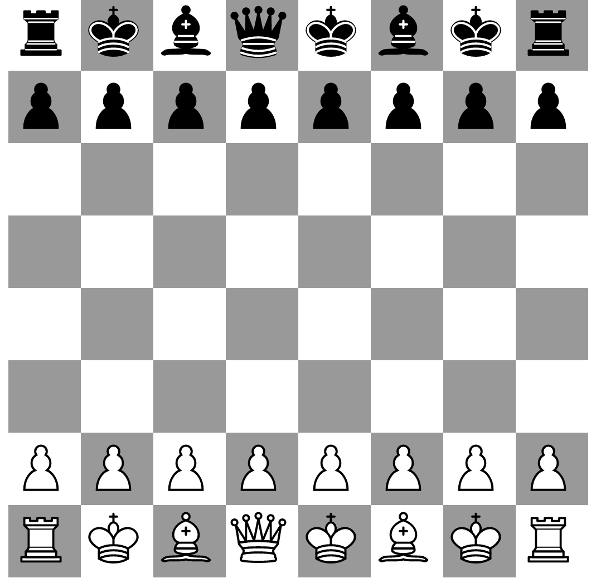

# Halogen Chess

[](https://github.com/peterbecich/halogen-chess/actions/workflows/haskell.yml)
[](https://github.com/peterbecich/halogen-chess/actions/workflows/purescript.yml)
[](https://github.com/peterbecich/halogen-chess/actions/workflows/nix.yml) 
[](https://github.com/peterbecich/halogen-chess/actions/workflows/ormolu.yml)

This project uses:

* [Purescript Bridge](https://github.com/eskimor/purescript-bridge)
* [Purescript Halogen](https://github.com/purescript-halogen/purescript-halogen) 
* [Purescript Halogen Store](https://github.com/thomashoneyman/purescript-halogen-store)
* [Purescript Routing](https://github.com/purescript-contrib/purescript-routing)
* [Purescript Routing Duplex](https://github.com/natefaubion/purescript-routing-duplex)
* [Haskell library chessIO](https://github.com/mlang/chessIO)

Buggy, and lots of inefficiencies in this single-page app; will be fixed later!



* `spago bundle-app --to static/index.js --watch`
* `cabal run halogen-chess`
* [http://localhost:8080](http://localhost:8080)


* `cabal run generate-purescript` to use Purescript Bridge

routes:
  * [http://localhost:8080/chess](http://localhost:8080/chess)
  * [http://localhost:8080/pageB](http://localhost:8080/pageB)
  * [http://localhost:8080/pageC](http://localhost:8080/pageC)


```
ghcid --command="cabal repl"
```
