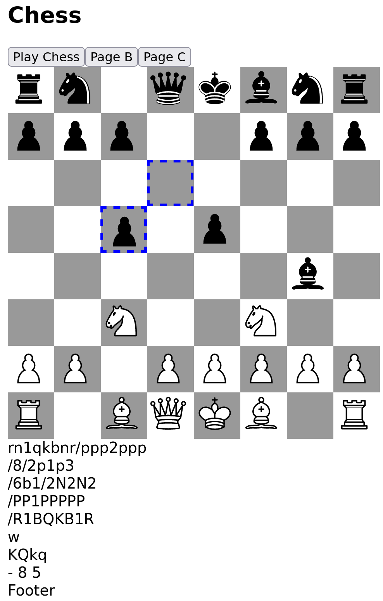

# Halogen Chess

 

This project demonstrates the [Purescript Bridge](https://github.com/eskimor/purescript-bridge) and [Purescript Halogen](https://github.com/purescript-halogen/purescript-halogen) libraries.

* `spago bundle-app --to static/index.js --watch`
* `cabal run halogen-chess`
* [http://localhost:8080](http://localhost:8080)
